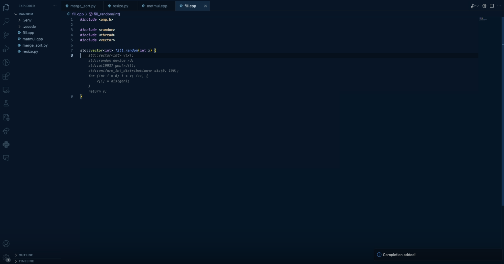

# Yaca (Yet another coding assistant)

Yaca is a coding assessment Visual Studio Code extension that helps you write faster code and learn new programming concepts. It is specially designed to help you provide code completions for highly performant code. Yaca is built on top of a RAG pipeline that uses a fine-tuned embeddings model trained for a corpus on highly performant code.



See the demo video [here](https://www.loom.com/share/5dea1ba9e8eb4ae18ea4914afa1e7ac4?sid=8d33ce42-b439-444f-b793-3df85db06891).

To create this code assistant, the following steps were taken:

1. Train a custom embeddings model on a corpus of highly performant code.
2. Benchmark the embeddings model against other models.
3. Incorporate the best embeddings model into a RAG pipeline for generating performance code completions.
4. Benchmark this RAG pipeline against other language models using the EffiBench benchmark.
5. Create a Visual Studio Code extension that queries a backend for code completions.
6. Create a backend that uses the RAG pipeline to generate code completions.

## Directories

This repository comprises a few directories, each of which will have their own README explaining their contents and purpose. These directories are the following:

`EffiBench`: Contains the code for the EffiBench benchmark.

`model`: Contains the code for training the embeddings model.

`yaca`: Contains the code for the Visual Studio Code extension.

`yaca-backend`: Contains the code for the backend that generates code completions.

From a high level, `EffiBench` and `model` should be used if you are interested in fine-tuning embeddings models and benchmarking them in different contexts. `yaca` and `yaca-backend` should be used if you are interested in the code completion assistant.

## Other Notable Files

`requirements.txt`: This file contains the dependencies required to run the code in this repository. Before running any code, ensure you have a virtual environment set up and have installed the dependencies:

```bash
python3 -m venv env
source env/bin/activate
pip3 install -r requirements.txt
```

`README.md`: This file contains the high-level overview of the repository.

[`FINDINGS.md`](./FINDINGS.md): This file contains general findings of the research done in the repository. At some point, I will create a proper paper for this research containing greater context and detail into the work done.
